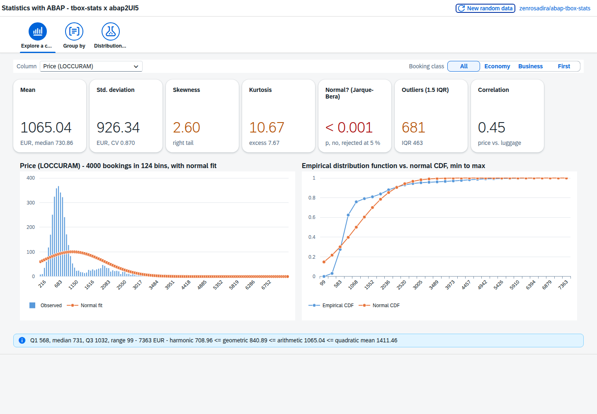
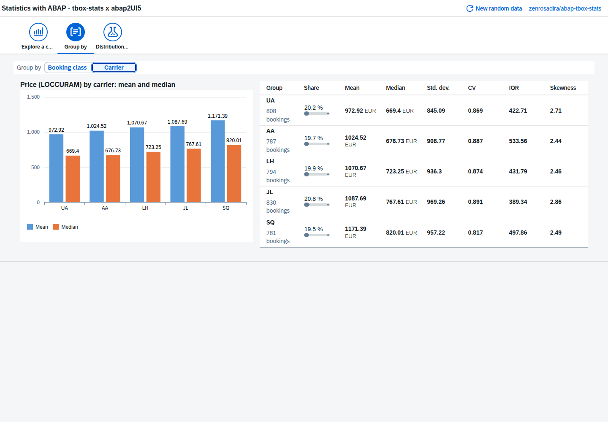
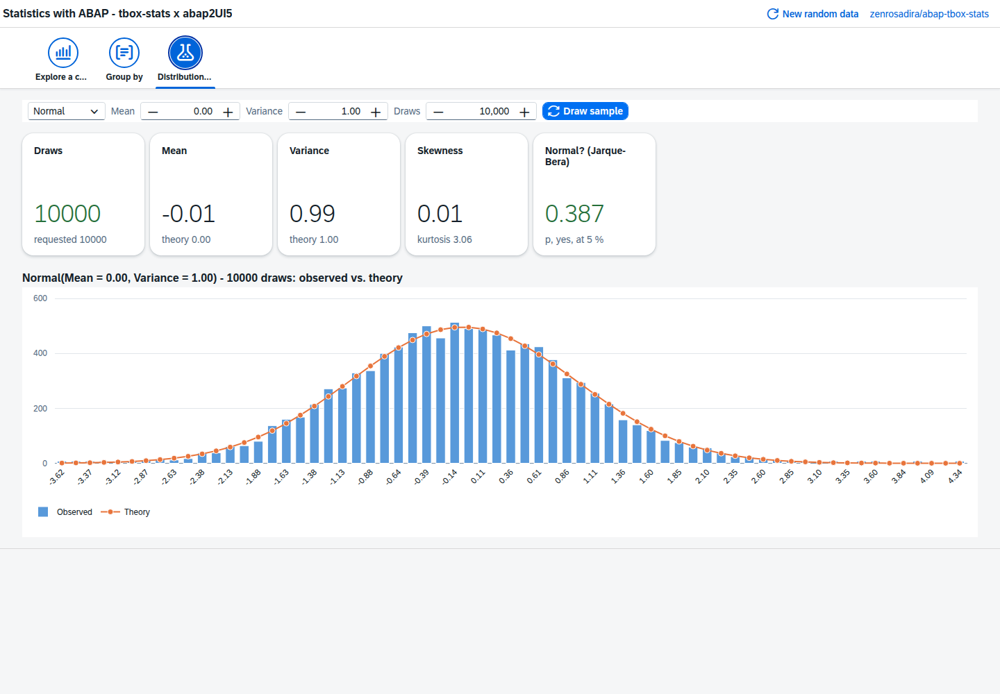

[](abaplint.jsonc)
[](https://github.com/abap2UI5/abap2UI5)
[](https://github.com/abap2UI5-addons/open-source-libs/actions/workflows/check-abap2ui5.yaml)
<br><br>
[](https://github.com/abap2UI5-addons/open-source-libs/actions/workflows/abap-standard.yaml)
<br>
[](https://github.com/abap2UI5-addons/open-source-libs/actions/workflows/check-abap2ui5.yaml)
[](https://github.com/abap2UI5-addons/open-source-libs/actions/workflows/check-rename.yaml)
<br>
[](https://github.com/abap2UI5-addons/open-source-libs/actions/workflows/build-rename.yaml)

# open-source-libs
abap2UI5 Sample Apps for Open-Source ABAP Libraries – Every Library with a UI

The ABAP open-source community has built many good libraries. Most of them come with a README and unit tests, but without a screen. This repository adds one: every package in `src/` is an [abap2UI5](https://github.com/abap2UI5/abap2UI5) app that puts one library to work in the browser, on your own system, written in nothing but ABAP. The libraries stay where they are — each sample uses its library as a dependency, it never copies it.

#### Samples
| Package | Library | App | What it shows |
|---|---|---|---|
| `src/01` | [abap-tbox-stats](https://github.com/zenrosadira/abap-tbox-stats) | `z2ui5_cl_osl_tbox_stats` | Descriptive statistics, group-by aggregations and random distributions as tiles and `sap.viz` charts |

#### tbox-stats – Statistics with ABAP (`src/01`)
The app generates a stand-in for the flight bookings table SBOOK — 4,000 bookings with price, booking class, carrier and luggage weight, drawn with tbox-stats' own random generators — and puts tbox-stats to work on it:

* **Explore a column** – mean, standard deviation, skewness, kurtosis, the Jarque–Bera normality test, outliers and a correlation; a histogram with its normal fit and the empirical CDF against the normal CDF; for all bookings or one booking class
* **Group by** booking class or carrier – count, share, mean, median, standard deviation, coefficient of variation, IQR and skewness per group
* **Distribution lab** – draw samples from the normal, uniform, Poisson, binomial, geometric and Bernoulli generators, change their parameters and compare the result with the theory

Every number is computed in ABAP by `ztbox_cl_stats`; the frontend only draws the bound tables.





#### Installation
1. Install [abap2UI5](https://github.com/abap2UI5/abap2UI5)
2. Install the library of the sample you want to run – for `src/01`, [abap-tbox-stats](https://github.com/zenrosadira/abap-tbox-stats)
3. Install this repository with abapGit

Each package needs abap2UI5 and its own library, nothing else.

#### Running a Sample – SAPUI5 for the Charts
The charts are `sap.viz` controls, which ship with SAPUI5 only. abap2UI5 bootstraps OpenUI5 by default, so switch the bootstrap to SAPUI5 in your abap2UI5 user exit — the SAPUI5 of your system or the one of the SAPUI5 CDN. If your installation already has an exit class, add the one line to it:

```abap
CLASS zcl_my_abap2ui5_exit DEFINITION PUBLIC FINAL CREATE PUBLIC.
  PUBLIC SECTION.
    INTERFACES z2ui5_if_ui5_exit.
ENDCLASS.

CLASS zcl_my_abap2ui5_exit IMPLEMENTATION.

  METHOD z2ui5_if_ui5_exit~set_config_http_get.
    " or the SAPUI5 of the system: /sap/public/bc/ui5_ui5/resources/sap-ui-core.js
    cs_config-src = `https://ui5.sap.com/resources/sap-ui-core.js`.
  ENDMETHOD.

  METHOD z2ui5_if_ui5_exit~set_config_http_post.
  ENDMETHOD.

ENDCLASS.
```

Then start the app class, e.g. `z2ui5_cl_osl_tbox_stats`, like any other abap2UI5 app.

#### Compatibility
* S/4 Private Cloud or On-Premise (Standard ABAP)
* SAP NetWeaver AS ABAP 7.50 or higher (Standard ABAP)
* SAPUI5 1.71 or higher

Not on ABAP Cloud yet: tbox-stats uses the data element `NAME_FELD` and the interface `IF_FSBP_CONST_RANGE`, neither of which is released for ABAP Cloud.

#### Security
The samples read no data from your system — the tbox-stats app generates its bookings itself. They carry no authorization check of their own; restrict who may start them before using them beyond a development system.

#### Dependencies
* [abap2UI5](https://github.com/abap2UI5/abap2UI5)
* The library of each sample (see [Samples](#samples))

#### Credits
* [abap-tbox-stats](https://github.com/zenrosadira/abap-tbox-stats) by [Marco Marrone](https://github.com/zenrosadira), MIT License

#### Your Library Here
Do you know an open-source ABAP library that deserves a UI? Open an issue, or add a sample yourself: one package per library, the library as a dependency — [CONTRIBUTING.md](CONTRIBUTING.md) has the steps.

#### Contribution & Support
Pull requests are welcome! Whether you're fixing bugs, adding new functionality, or improving documentation, your contributions are highly appreciated. If you encounter any issues, feel free to open an issue.
